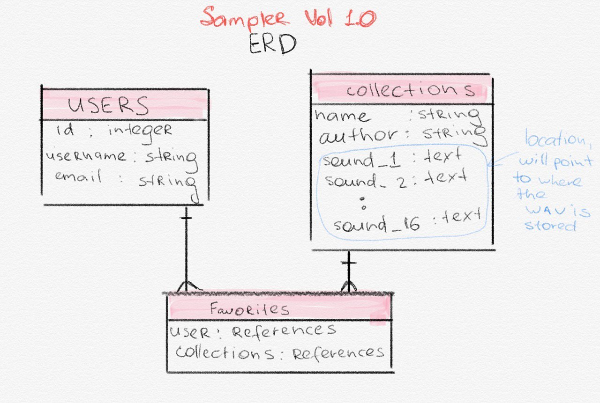

# Audio Sampler Project Vol. 1.0

# Project Description
This project is an in-browser DJ Audio Sampler. A sampler is an electronic or digital musical instrument which uses sound recordings (or "samples") of real instrument sounds(Wikipedia).

The app allows a user to pick a collection of pre-built audio samples or create their own collection and play music in the same way DJs do!

A RESTful API for the project is built with Ruby and Ruby on Rails.
An Relational Database is used in the project with the use of PostgreSQL. The back end is connected to the front end with AJAX technology.

## Table of contents
* [Development process](#development-process)
* [Links](#links)
* [Technologies](#technologies)
* [ToDo List](#to-do-list)
* [Status](#status)
* [License](#license)
* [Contact](#contact)

## Development process

For the project I decided to use a relational database. The tables in the DB are connected with one-to-many relationship. Here are the ERDs created in the brainshtorm phase of the project development:

The API was created with Ruby on Rails framework with some custom changes. In particular, I changed the 'collection' controller to inherit from Open Read Controller, what allows us to protech the database from unwanted changes from unauthorized users.

## Links
Deployed App (Front End): https://elinagorshkova.github.io/sampler-vol-1.0/

GitHub Repo (Front End): https://github.com/elinagorshkova/sampler-vol-1.0

Deployed Back End: https://agile-ocean-62490.herokuapp.com/

GitHub Repo (Back End): https://github.com/elinagorshkova/sampler-api-client

## Technologies
Project created with:
* Ruby
* Ruby on Rails
* SQL
* PostgreSQL
* Ajax

## To-do list:
* Store data: the database should be able to store heavy media files.
* Add Favorites table with many-to-many relation, as it was planned originally (user has many favorites, collection has many favorites) (refer to ERD).

## Status
Project is in progress.
Continue adding new features.

## License

This project is licensed under the terms of the MIT license. See the LICENSE file for details.

## Contact
Created by Elina Gorshkova(https://github.com/elinagorshkova, https://www.linkedin.com/in/egorshkova/) - feel free to contact me!
